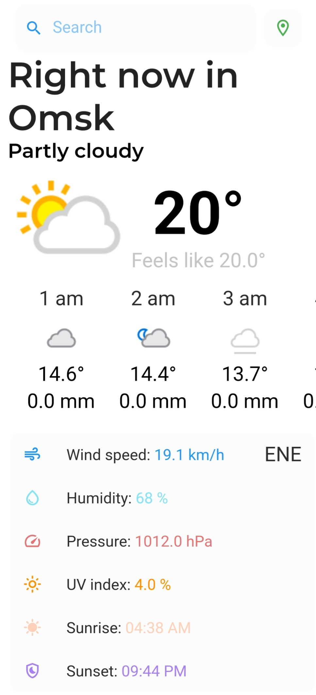

## О приложении Weather App

В приложении реализованы следующие функции:

- выбор города + определение текущего местоположения;

- данные о температуре на текущий момент;

- данные о температуре и осадках в течение дня с интервалом в час;

- данные о погоде на текущий момент;

Приложение выпонено студенткой группы МО-201 Зубовой Юлией в качестве задания по летней практике.

